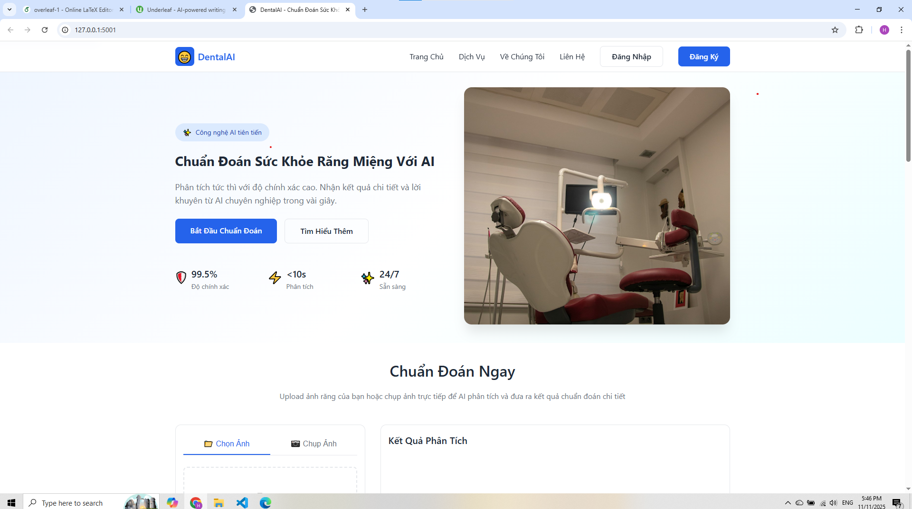
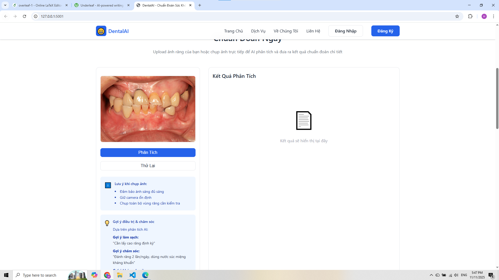
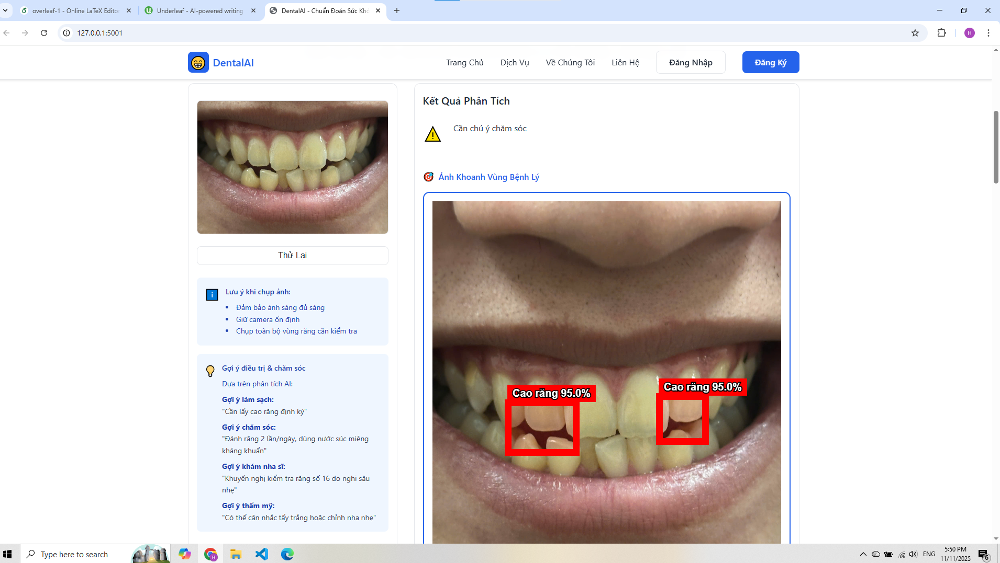
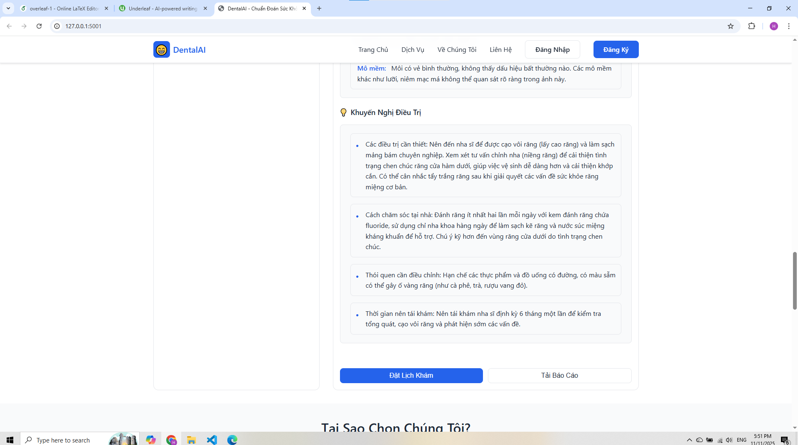

<h2 align="center">
    <a href="https://dainam.edu.vn/vi/khoa-cong-nghe-thong-tin">
    🎓 Faculty of Information Technology (DaiNam University)
    </a>
</h2>
<h2 align="center">
   DENTALAI: HỆ THỐNG CHẨN ĐOÁN SỨC KHỎE RĂNG MIỆNG
</h2>
<div align="center">
    <p align="center">
        
        
        
    </p>

[](https://www.facebook.com/DNUAIoTLab)
[](https://dainam.edu.vn/vi/khoa-cong-nghe-thong-tin)
[](https://dainam.edu.vn)

</div>

# 📖 1. Giới thiệu
DentalAI là một hệ thống chẩn đoán sơ bộ sức khỏe răng miệng dựa trên trí tuệ nhân tạo, được phát triển để hỗ trợ sàng lọc và tư vấn ban đầu cho người dân. Hệ thống kết hợp nhiều công nghệ AI tiên tiến nhằm cung cấp công cụ chẩn đoán tin cậy và dễ tiếp cận.

Hệ thống đáp ứng các yêu cầu cơ bản của một giải pháp AI y tế:

📌 Phát hiện đa tổn thương:

    Sử dụng YOLOv8 để phát hiện và định vị chính xác các tổn thương răng miệng.

    Hỗ trợ phát hiện sâu răng, viêm nướu, cao răng, đổi màu răng và các tổn thương khác.

    Cơ chế fallback detector đảm bảo luôn có kết quả phân tích.

📌 Phân loại tình trạng tổng thể:

    CNN deep learning phân loại tổng thể (bình thường/sâu răng/viêm nướu/mảng bám).

    Cung cấp confidence score và probability distribution chi tiết.

    Kết hợp multi-model để tăng độ chính xác.

📌 Tư vấn thông minh:

    Tích hợp Gemini LLM để sinh khuyến nghị chăm sóc bằng ngôn ngữ tự nhiên.

    Giải thích kết quả một cách dễ hiểu cho người dùng thông thường.

    Cung cấp lời khuyên chăm sóc và phòng ngừa phù hợp.

📌 Giao diện web thân thiện:

    Frontend HTML/CSS/JavaScript responsive, tối ưu cho mọi thiết bị.

    Upload và preview ảnh real-time với drag & drop.

    Hiển thị kết quả trực quan với bounding boxes và annotations.

🔹 Ý nghĩa ứng dụng:
    Hệ thống giúp người dân và cộng đồng y tế:

    Sàng lọc sớm các vấn đề răng miệng tại nhà hoặc tuyến cơ sở.

    Tiếp cận công nghệ AI hiện đại trong chăm sóc sức khỏe.

    Giảm tải cho hệ thống y tế bằng cách phát hiện sớm và tư vấn ban đầu.

    Nâng cao nhận thức về chăm sóc sức khỏe răng miệng trong cộng đồng.

# 🔧 2. Công nghệ sử dụng  

[](https://www.python.org/) 
[](https://flask.palletsprojects.com/) 
[](https://ultralytics.com/) 
[](https://tensorflow.org/) 
[](https://opencv.org/) 
[](https://deepmind.google/technologies/gemini/) 
[](https://developer.mozilla.org/en-US/docs/Web/JavaScript) 
[](https://developer.mozilla.org/en-US/docs/Web/HTML) 
[](https://developer.mozilla.org/en-US/docs/Web/CSS) 


# 🚀 3. Một số hình ảnh của hệ thống

<p align="center">
  
</p>

<p align="center">
  <em>Hình 1: Giao diện trang chủ DentalAI</em>
</p>

<p align="center">
  
</p>
<p align="center">
  <em>Hình 2: Màn hình tải ảnh răng miệng</em>

</p>

<p align="center">
  
</p>
<p align="center">
  <em>Hình 3: Kết quả phân tích chi tiết với AI</em>
</p>
  
</p>

<p align="center">
  
</p>
<p align="center">
  <em>Hình 4: Khuyến nghị điều trị và chăm sóc từ Gemini AI</em>
</p>


# ⚡ 4. Các bước cài đặt

### 🔧 Bước 1: Chuẩn bị môi trường
- 🐍 Cài đặt **Python 3.10+**  
- 📦 Cài đặt **pip** package manager  
- 🔗 Cài đặt **Git** để clone repository

---
### 📥 Bước 2: Clone repository
```bash
git clone https://github.com/minhhoai55/DentalAI.git
cd DentalAI
```

---

### 📦 Bước 3: Cài đặt dependencies
```bash
pip install -r requirements.txt
```

📋 **Các thư viện chính**:
- `ultralytics` (YOLOv8)
- `tensorflow` (CNN models)
- `opencv-python` (Computer Vision)
- `flask` (Web framework)
- `google-generativeai` (Gemini AI)

---

### ⚙️ Bước 4: Cấu hình API keys
Tạo file **`.env`** trong thư mục gốc:  
        
```bash
GEMINI_API_KEY=your_gemini_api_key_here
```

🔑 Lấy Gemini API key tại: [Google AI Studio](https://makersuite.google.com/app/apikey)

### ▶️ Bước 5: Chạy hệ thống

## 🖥️ Chạy **Backend Server**
```bash
cd api
python app_hybrid.py
```
- 🌐 Server sẽ chạy trên **`http://localhost:5001`**  

---

## 💻 Mở **Frontend**
- 📂 Mở **`frontend/index.html`** trên trình duyệt  
- 🔗 Hoặc truy cập **`http://localhost:5001`** để dùng integrated frontend

---

## 🎯 Sử dụng hệ thống
1. 📷 **Upload ảnh răng miệng** qua giao diện web
2. ⏳ Chờ hệ thống **phân tích** với AI pipeline (YOLO + CNN + CV + LLM)
3. 📊 Xem **kết quả chi tiết**:
   - Phát hiện tổn thương (bounding boxes)
   - Phân loại tổng thể (confidence scores)  
   - Khuyến nghị chăm sóc (natural language)
4. 💾 **Tải xuống** ảnh đã được chú thích

---

### 🤖 Training Models (Tùy chọn)
Sử dụng Jupyter notebooks để train lại models:
```bash
jupyter notebook train_yolo_kaggle.ipynb    # YOLOv8 training
jupyter notebook train_detection.ipynb      # Detection model  
jupyter notebook train_kaggle.ipynb         # Kaggle dataset
```

### 📁 Cấu trúc dự án
```
DentalAI/
├── 📂 api/                           # Backend Flask API
│   ├── 🐍 app_hybrid.py             # Main hybrid application  
│   ├── 🤖 tooth_detector.py         # YOLOv8 detector
│   ├── 👁️ simple_tooth_detector.py  # Computer vision detector
│   ├── 🧠 gemini_client.py          # Gemini AI integration
│   └── ⚙️ app.py                    # Basic application
├── 📂 frontend/                      # Web interface
│   ├── 🌐 index.html               # Main page
│   ├── 🎨 css/style.css            # Stylesheets  
│   └── ⚡ js/script.js             # JavaScript logic
├── 📂 src/                          # Source code
│   ├── 🤖 ai/dental_predictor.py   # AI prediction logic
│   └── 🏗️ models/cnn_model.py      # CNN model definition
├── 📂 models/                       # Trained AI models
├── 📂 docs/                         # Documentation & Images
│   ├── 📄 overleaf-1/              # IEEE paper LaTeX
│   └── 🖼️ logo/                    # University logos
├── 📓 *.ipynb                       # Jupyter training notebooks
└── 📋 requirements.txt              # Python dependencies
```

---

## 🏗️ Kiến trúc hệ thống

**Kiến trúc 3 lớp tích hợp AI**:
1. **🎨 Presentation Layer**: Responsive web frontend (HTML/CSS/JS)
2. **⚙️ Application Layer**: Flask REST API với multi-threading
3. **🧠 Intelligence Layer**: Multi-AI models (YOLO + CNN + CV + LLM)

### 🔄 Pipeline xử lý thông minh

```
📷 Upload Image → 🔍 Simple Detector → 👁️ CV Detector → 🤖 YOLO → 🧠 CNN → 💬 Gemini LLM → 📊 Results
```

**⚡ Performance Metrics**:
- 🎯 YOLO inference: ~120ms
- 🧠 CNN classification: ~40ms  
- 👁️ Computer vision detector: ~25ms
- 💬 Gemini LLM: 1.2-2.5s
- ⚡ **Total processing: < 3s**

---

## 📚 Tài liệu kỹ thuật

- 📄 **IEEE Conference Paper**: [`docs/overleaf-1/main_ieee.tex`](docs/overleaf-1/main_ieee.tex)
- 🔧 **API Documentation**: [`api/app_hybrid.py`](api/app_hybrid.py)  
- 📊 **Model Architecture**: [`src/models/cnn_model.py`](src/models/cnn_model.py)

---

# 🔧 5. Liên hệ (cá nhân)

**Họ tên**: Khổng Minh Hoài

**Lớp**: CNTT 16-04

**Email**: hoaikhong.15052004@gmail.com

**Giảng viên hướng dẫn**: 
- ThS. Nguyễn Thái Khánh
- ThS. Lê Trung Hiếu

© 2025 AIoTLab, Faculty of Information Technology, DaiNam University. All rights reserved.

---

⭐ **Nếu dự án hữu ích, hãy để lại một star trên GitHub!**

🤝 **Đóng góp**: Fork → Create branch → Commit → Push → Pull Request

📄 **License**: MIT License - Sử dụng tự do cho mục đích học tập và nghiên cứu
